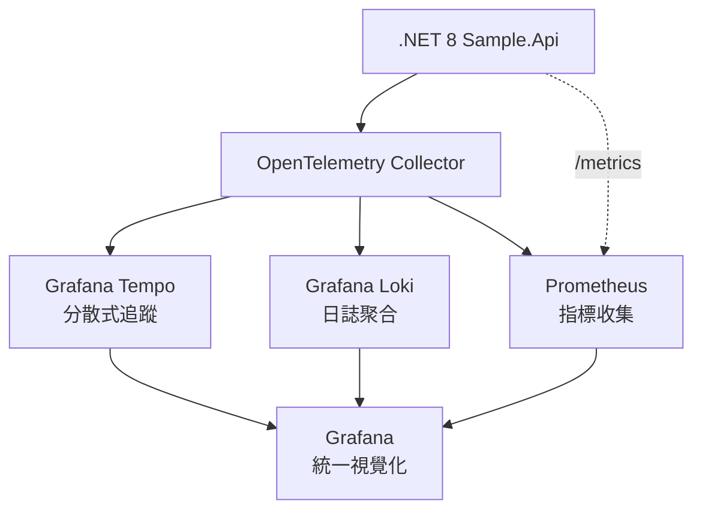

# .NET 8 Observability Stack

> **Version**: 0.1.0  
> **Status**: PoC Complete ✅

一個完整的 .NET 8 可觀測性解決方案，展示如何使用 OpenTelemetry、Tempo、Prometheus 和 Loki 實現分散式追蹤、指標收集和日誌聚合。

## 🎯 專案目標

建立一個標準化、靈活且不受特定供應商限制的可觀測性技術棧，為 .NET 專案提供三大支柱：

- **📊 Metrics (指標)**: Prometheus + OpenTelemetry
- **📝 Logs (日誌)**: Loki + structured logging
- **🔍 Traces (追蹤)**: Tempo + distributed tracing

## 🏗️ 架構概覽



## 🚀 快速開始

### 前置需求

- Docker & Docker Compose
- .NET 8 SDK (用於開發)
- curl & jq (用於測試)

### 啟動服務

```bash
# 啟動所有服務
docker compose up -d

# 檢查服務狀態
docker compose ps
```

### 驗證部署

```bash
# 檢查 API 健康狀態
curl http://localhost:8088/weatherforecast

# 檢查 Prometheus 指標
curl http://localhost:8088/metrics

# 檢查 Tempo API
curl http://localhost:3200/ready
```

## 🔧 服務端點

| 服務 | 端點 | 用途 |
|------|------|------|
| **Sample.Api** | http://localhost:8088 | .NET 8 應用程式 |
| **Swagger UI** | http://localhost:8088/swagger | API 文檔 |
| **Grafana** | http://localhost:3000 | 統一監控介面 (admin/admin) |
| **Prometheus** | http://localhost:9090 | 指標查詢 |
| **Tempo** | http://localhost:3200 | 追蹤查詢 |
| **Loki** | http://localhost:3100 | 日誌查詢 |

## 📦 API 端點

### 簡單端點 (用於基礎測試)
- `GET /weatherforecast` - 簡單的天氣資料 API

### 複雜端點 (用於分散式追蹤展示)
- `POST /api/order/create` - 訂單建立流程

#### 訂單 API 範例
```bash
curl -X POST http://localhost:8088/api/Order/create \
  -H "Content-Type: application/json" \
  -d '{
    "orderId": "order-123",
    "customerId": "customer-456", 
    "productId": "product-789",
    "quantity": 2,
    "amount": 299.99
  }'
```

## 🎭 產生測試流量

使用內建的腳本產生各種類型的 traces：

```bash
# 執行自動化測試腳本
./generate_traces.sh
```

這將產生：
- 5 個複雜的訂單 API 呼叫 (多層 spans)
- 3 個簡單的天氣 API 呼叫 (基礎 spans)
- 3 個並行的訂單處理 (平行 traces)

## 📊 可觀測性分析

### 在 Grafana 中查看 Traces

1. 訪問 http://localhost:3000 (admin/admin)
2. 進入 **Explore** 
3. 選擇 **Tempo** 資料源
4. 使用 TraceQL 查詢：

```sql
# 查看所有 Sample.Api 的 traces
{service.name="Sample.Api"}

# 查看耗時超過 500ms 的 traces
{service.name="Sample.Api"} | duration > 500ms

# 查看特定客戶的訂單
{customer.id="customer-123"}

# 查看複雜的訂單處理流程
{span.name="CreateOrder"}
```

### Traces 結構分析

**複雜 Trace (Order API)**:
```
POST api/Order/create (900ms)
└── CreateOrder
    ├── CheckInventory (155ms)
    ├── ProcessPayment (476ms)  ⭐ 通常是瓶頸
    ├── SendNotification (113ms)
    └── UpdateInventory (157ms)
```

**簡單 Trace (Weather API)**:
```
GET WeatherForecast (2ms)
└── [基本 HTTP processing]
```

## 🏷️ 重要 Trace 標籤

- `order.id`: 訂單識別碼
- `customer.id`: 客戶識別碼
- `product.id`: 產品識別碼
- `quantity`: 訂購數量
- `amount`: 訂單金額

## 📁 專案結構

```
├── src/
│   └── Sample.Api/           # .NET 8 Web API
├── docker/
│   ├── grafana/             # Grafana 設定和儀表板
│   ├── otel-collector/      # OpenTelemetry Collector 設定
│   ├── prometheus/          # Prometheus 設定
│   └── tempo/               # Tempo 設定
├── memory-bank/             # 專案文檔和記憶庫
├── docker-compose.yml       # 服務編排
├── generate_traces.sh       # 測試流量生成腳本
└── README.md
```

## 🔍 疑難排解

### 常見問題

1. **服務啟動失敗**
   ```bash
   docker compose down
   docker compose up -d --build
   ```

2. **Traces 不顯示**
   - 檢查 OpenTelemetry Collector: `curl http://localhost:8889/metrics`
   - 檢查 Tempo: `curl http://localhost:3200/ready`

3. **Port 衝突**
   - 檢查 port 8088, 3000, 9090 是否被佔用

### 除錯命令

```bash
# 檢查服務日誌
docker compose logs sample-api
docker compose logs otel-collector
docker compose logs tempo

# 檢查 Tempo 中的 traces
curl "http://localhost:3200/api/search?limit=10" | jq '.'

# 檢查 OpenTelemetry metrics
curl http://localhost:8889/metrics | grep otel
```

## 🎉 成功指標

- ✅ .NET 8 應用成功整合 OpenTelemetry
- ✅ 複雜的分散式追蹤鏈 (4-5 個 spans)
- ✅ 三種資料類型完整收集：Logs、Metrics、Traces
- ✅ Grafana 統一視覺化介面
- ✅ 生產就緒的 Docker Compose 設定

## 📚 相關文檔

- [Memory Bank](./memory-bank/) - 完整的專案文檔
- [專案簡介](./memory-bank/projectbrief.md) - 專案背景和目標
- [技術架構](./memory-bank/systemPatterns.md) - 系統設計模式

## 🤝 貢獻

這是一個 PoC 專案，歡迎提出改進建議：

1. Fork 此專案
2. 建立 feature branch (`git checkout -b feature/amazing-feature`)
3. 提交變更 (`git commit -m 'feat: add amazing feature'`)
4. Push 到 branch (`git push origin feature/amazing-feature`)
5. 建立 Pull Request

## 📄 授權

此專案使用 MIT 授權 - 詳見 [LICENSE](LICENSE) 檔案

---

**🚀 Version 0.1.0** - 完整的 .NET 8 可觀測性 PoC 